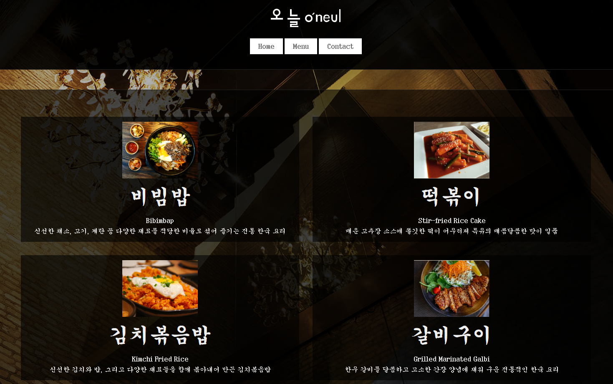

# 레스토랑 홈페이지

- 레스토랑 홈페이지를 동적으로 렌더링, JavaScript를 통해 DOM 조작으로 생성
- 모듈 번들링을 위해 webpack을 사용

- [Live Preview](https://github-sjl.github.io/odin-project_restaurant_page/)
## 목차
```
📦src
 ┣ 📂components
 ┃ ┣ 📜footer.js
 ┃ ┣ 📜header.js
 ┃ ┣ 📜main.js
 ┃ ┗ 📜nav.js
 ┣ 📂page
 ┃ ┣ 📜contact.js
 ┃ ┣ 📜home.js
 ┃ ┗ 📜menu.js
 ┣ 📜index.html
 ┣ 📜index.js
 ┗ 📜style.css
```

- src/components/footer.js: footer 컴포넌트를 생성하고 관리하는 모듈.
- src/components/header.js: header 컴포넌트를 생성하고 관리하는 모듈.
- src/components/main.js: main 콘텐츠 영역을 생성하고 관리하는 모듈.
- src/components/nav.js: 내비게이션 바를 생성하고 관리하는 모듈.
- src/page/home.js: 홈페이지 콘텐츠 생성을 위한 모듈.
- src/page/menu.js: 메뉴 페이지 콘텐츠 생성을 위한 모듈.
- src/page/contact.js: 연락처 페이지 콘텐츠 생성을 위한 모듈.
- src/index.html: HTML 스켈레톤.
- src/style.css: 프로젝트의 스타일링을 정의하는 CSS 파일.
- src/index.js: JavaScript 진입점으로
- webpack.config.js: Webpack 구성 파일로, 번들링 설정을 관리합니다.

## 배포
1. 프로젝트 빌드: ```npm run build```

2. 배포: ```npm run deploy```


## 프로젝트 회고
- 이번 프로젝트를 통해 자바스크립트로 HTML을 동적으로 생성할 수 있다는 것을 배우고, React에서 새로고침 없이 페이지가 전환되는 방식도 대략적으로 파악할 수 있었습니다.
- 또한 웹팩을 사용하면서 HTML, JavaScript, CSS를 어떻게 번들링하고 배포하는지 익혔습니다. 프레임워크가 자동으로 처리해주는 부분들을 직접 설정해보니, 그동안 간과했던 세부 사항들을 한 단계 더 깊이 이해하게 되었습니다.
- 프레임워크에 의존하게 되면 기초적인 설정이나 세세한 부분들을 놓칠 수 있고, 오류나 요구사항들을 해결할 때 시야가 넓어질 수 있다는 점을 깨달았습니다. 이번 경험을 통해 기본을 탄탄히 다지는 것이 얼마나 중요한지 다시 한 번 느꼈습니다.

